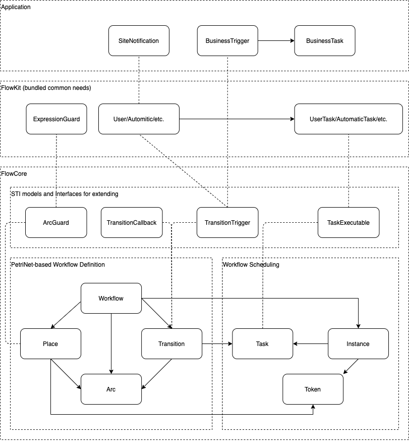
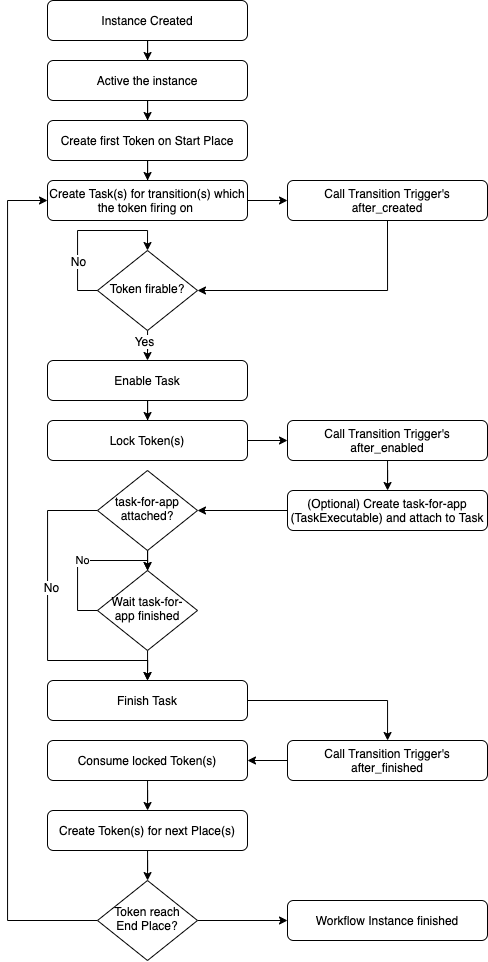

Flow Core
===

> FlowCore is ready for open reviewing, but it haven't tested in production yet,
> any help are most welcome, breaking change is acceptable.

A multi purpose, extendable, Workflow-net-based workflow engine for Rails applications.

FlowCore is an open source Rails engine provides core workflow functionalities,
including workflow definition and workflow instance scheduling.
Easily making automation (including CI, CD, Data processing, etc.) and BPM applications or help you solve parts which changing frequently.

## Features

### Support all databases which based on ActiveRecord

All persistent data are present as ActiveRecord model and not use any DB-specific feature.

### Easy to extend & hack

FlowCore basically followed best practice of Rails engine,
you can extend as [Rails Guides](https://guides.rubyonrails.org/engines.html#improving-engine-functionality) suggests.

Your app-specific workflow triggers, callbacks and guards can be extended via [Single Table Inheritance](https://guides.rubyonrails.org/association_basics.html#single-table-inheritance)

FlowCore also provides callbacks for triggers (which control behavior of a transition) covered whole task lifecycle.

### Petri-net based

[Petri-net](https://en.wikipedia.org/wiki/Petri_net) is a technique for description and analysis of concurrent systems.

FlowCore choose its special type called [Workflow-net](http://mlwiki.org/index.php/Workflow_Nets) to expressing workflow.

Compared to more popular activity-based workflow definitions (e.g BPMN),
Petri-net has only few rules but could express very complex case.

Check [workflow patterns](http://workflowpatterns.com) to learn how to use Petri-net expressing workflows.

### Basic workflow checking.

A workflow should be verified first before running it.

FlowCore provides the mechanism to help to prevent unexpected error on instance running

> This is the hard work and help wanted
> Workflow-net has [soundness](http://mlwiki.org/index.php/Workflow_Soundness) checking but I don't know how to implement it

### Interfaces and abstractions to integrate your business

FlowCore separate app-world and engine-world using interfaces and abstract classes,
basically you no need to know Workflow-net internal works.

### Runtime error and suspend support

FlowCore provides necessary columns and event callbacks for runtime error and suspend.

### A DSL to simplify workflow creation

FlowCore provides a powerful DSL for creating workflow.

## Demo

**You need to install Graphviz first**

Clone the repository.

```sh
$ git clone https://github.com/rails-engine/flow_core.git
```

Change directory

```sh
$ cd flow_core
```

Run bundler

```sh
$ bundle install
```

Preparing database

```sh
$ bin/rails db:migrate
```

Import sample workflow

```sh
$ bin/rails db:seed
```

Start the Rails server

```sh
$ bin/rails s
```

Open your browser, and visit `http://localhost:3000`

## Design

Architecture:



Basic design based on [An activity based Workflow Engine for PHP By Tony Marston](https://www.tonymarston.net/php-mysql/workflow.html).

Some notable:

- Arc: The line to connecting a Place and a Transition
- ArcGuard: The matcher to decide the arc is passable,
            it's an base class that you can extend it for your own purpose.
- Task: A stateful record to present current workflow instance work,
        and can reference a `TaskExecutable` through Rails polymorphic-reference.
        It finish means the transition is done and can moving on.
- TaskExecutable: An interface for binding App task and FlowCore Task.
- TransitionTrigger: It controls the behavior of a Transition,
                     it's an base class that you can extend it for your own purpose,
                     best place for implementing business.
- TransitionCallback: It can be registered to a Transition, and be triggered on specified lifecycle(s) of Task

### Lifecycle of Task

- `created` Task created by a Petri-net Token
- `enabled` Transit to this stage when next transition requirement fulfilled
    - Best chance to create app task (your custom task for business) in `TransitionTrigger#on_task_enabled`
- `finished` Normal ending
    - Require app task finished first (if bind)
- `terminated` Task killed by instance (e.g Instance cancelled) or other race condition task



### FlowKit

Because FlowCore only care about essentials of workflow engine,
I'm planning a gem based on FlowCore to provides BPM-oriented features, including:

- Dynamic form
- Approval Task with assignment
- ExpressionGuard

### Why "core"

Because it's not aim to "out-of-box",
some gem like Devise giving developer an out-of-box experience, that's awesome,
but on the other hand, it also introducing a very complex abstraction that may hard to understanding how it works,
especially when you attempting to customize it.

I believe that the gem is tightly coupled with features that face to end users directly,
so having a good customizability and easy to understanding are of the most concern,
so I just wanna give you a domain framework that you can build your own that just fitting your need,
and you shall have fully control and without any unnecessary abstraction.

## TODO / Help wanted

- Document
- Test
- Activity-based to Petri-net mapping that will possible to integrate to existing visual editors (with some modification),
  see <https://www.researchgate.net/figure/The-mapping-between-BPMN-and-Petri-nets_tbl2_221250389> for understanding.
- More efficient and powerful workflow definition checking
- Grammar and naming correction (I'm not English native-speaker)

## Usage

> WIP

### Deploy a workflow

See [test/dummy/db/seeds.rb](test/dummy/db/seeds.rb) to learn the DSL, more complex sample see [test/dummy/app/models/internal_workflow.rb](test/dummy/app/models/internal_workflow.rb)

### Running a workflow

`workflow.create_instance!`

### Implementing an ArcGuard

[test/dummy/app/models/arc_guards/dentaku.rb](test/dummy/app/models/arc_guards/dentaku.rb) shows an expression guard which using [Dentaku](https://github.com/rubysolo/dentaku)

### Implementing a TransitionTrigger

[test/dummy/app/models/transition_triggers/timer.rb](test/dummy/app/models/transition_triggers/timer.rb) shows a delayed trigger which can be used for expires.

[test/dummy/app/models/transition_triggers/user_task.rb](test/dummy/app/models/transition_triggers/user_task.rb) shows a simple user task with a simple assignment.

### Implementing a TransitionCallback

[test/dummy/app/models/transition_callbacks/notification.rb](test/dummy/app/models/transition_callbacks/notification.rb) shows a simple callback that notify the assignee when the task started

### Implementing a TaskExecutable

[test/dummy/app/models/user_task.rb](test/dummy/app/models/user_task.rb) shows a sample,
[test/dummy/app/models/approval_task.rb](test/dummy/app/models/approval_task.rb) shows how to set payload to task that use for ArcGuard

### Extending Workflow

[test/dummy/app/models/internal_workflow.rb](test/dummy/app/models/internal_workflow.rb) shows how to use STI extending Workflow.

[test/dummy/app/overrides/models/flow_core/workflow_override.rb](test/dummy/app/overrides/models/flow_core/workflow_override.rb) shows how to apply Rails override pattern to extend base model,
here I add `to_graphviz` for dummy app visualize workflows.

## Requirement

- Rails 6.0+
- Ruby 2.5+

## Installation

Add this line to your application's Gemfile:

```ruby
gem "flow_core"
```

Or you may want to include the gem directly from GitHub:

```ruby
gem 'flow_core', github: 'rails-engine/flow_core'
```

And then execute:

```bash
$ bundle
```

Or install it yourself as:

```bash
$ gem install flow_core
```

## References

- [hooopo/petri_flow](https://github.com/hooopo/petri_flow) (my partner's version, we share the same basis)
- <http://mlwiki.org/index.php/Petri_Nets>
- <https://www.tonymarston.net/php-mysql/workflow.html>
- <http://workflowpatterns.com/>

## Contributing

Bug report or pull request are welcome.

### Make a pull request

1. Fork it
2. Create your feature branch (`git checkout -b my-new-feature`)
3. Commit your changes (`git commit -am 'Add some feature'`)
4. Push to the branch (`git push origin my-new-feature`)
5. Create new Pull Request

Please write unit test with your code if necessary.

## License

The gem is available as open source under the terms of the [MIT License](https://opensource.org/licenses/MIT).
