FlowCore
====

> FlowCore 的设计还未稳定，开发过程可能会引入破坏性改动

FlowCore 是一个为你的 Rails 程序提供工作流引擎核心的 Rails Engine，方便你构建如 OA、BPM、自动化 等场景的应用。

FlowCore 不打算发展成如 Devise 那样的开箱即用解决方案。
贴近具体业务的库很难设计，设计得太简单，无法满足业务需要，设计得太复杂，理解困难（特别是在需要定制的时候）。
故 FlowCore 的设计哲学在于尽可能准确的定义工作流领域要解决的问题和提出一套解决这些问题的框架，然后解决业务无关的部分，
抽象与实际业务相关的部分，交由应用开发者实现。
FlowCore 的目标是降低涉及工作流的应用的开发门槛和保持开发者对项目的自主可控。

FlowCore 必须嵌入到 Rails 程序中使用，提供了以下基础设施：

- **工作流保存在数据库：** 支持用户（或管理员）定义流程
- **流程建模：** 提供了两套建模语言，高层的 Pipeline 和底层的 WorkflowNet，两者关系如同 ActiveRecord 和 Arel
  - **PetriNet：** 底层的，用于执行工作流的建模语言
    - 适合描述异步、并发的计算机系统模型，能够描述非常复杂的并行状态
    - 有少量规则需要学习
  - **Pipeline：** 原创的，基于流程图的建模语言，非技术人员容易理解
    - 为实现实现可视化编辑提供便利
    - 可扩展步骤类型，内置了：任务、并发分支、单选分支、跳转、结束
    - 需要编译到 WorkflowNet 运行
    - 保证流程的正确性（不会在执行时卡住）为先
- **可扩展的工作流相关抽象：** 提供了集成所需要的抽象模型和接口
- **流程任务调度：** 管理流程实例的整个生命周期，根据流程的定义来控制任务创建，每个任务的状态独立维护

当你面临如下场景时你很可能需要 FlowCore：

- 明确的 BPM、OA 类型的应用
- 用户（或系统管理员）在服务运行期间可配置流程，并且：
  - 流程内的任务存在并发（单任务使用 FSM 即可满足需求）
  - 任务耗时较长或异步运行，能够接受毫秒级的任务调度成本
- 类似 Airflow、IFTTT 类型的自动化系统，同一流程实例的任务有如下特点：
  - 多个任务并发执行
  - 任务间有依赖关系

## 目录

- 简介
  - [特性](#特性)
  - [架构](#架构)
  - [概念](#概念)
  - [快速开始](#快速开始)
  - [Demo](#demo)
  - [如何贡献](#如何贡献)
  - [TODO](#todo)
  - [参考资料](#参考资料)
  - [许可协议](#许可协议)
- [使用指南](guides/tutorials.zh-CN.md)
  - [使用要求](guides/tutorials.zh-CN.md#要求)
  - [安装](guides/tutorials.zh-CN.md#安装)
  - [实现工作流托管任务](guides/tutorials.zh-CN.md#实现工作流托管任务)
  - [实现任务触发器](guides/tutorials.zh-CN.md#实现任务触发器)
  - [实现分支比较器](guides/tutorials.zh-CN.md#实现分支比较器)
  - [扩展工作流类型](guides/tutorials.zh-CN.md#扩展工作流类型)
  - [使用工作流](guides/tutorials.zh-CN.md#使用工作流)
- [Dummy 源码解读](guides/how_dummy_built.zh-CN.md)
- [Pipeline 规则说明](guides/pipeline.zh-CN.md)
- [技术内幕](guides/internals.zh-CN.md)
  - (WIP) [工作流实例的生命周期](guides/internals.zh-CN.md#工作流实例的生命周期)
  - [数据库表结构说明](guides/internals.zh-CN.md#数据库表结构说明)

## 特性

### 支持所有 ActiveRecord 支持的数据库

FlowCore 所有的内部数据都使用 ActiveRecord 建模，并且不使用任何特定数据库限定的特性

### 围绕 Rails 生态构建，易于扩展

FlowCore 可以充分利用 Rails 的生态，比如你可以通过 ActiveJob 实现异步任务。

FlowCore 与业务相关的模型均支持使用 [Rails STI（单表继承）](https://guides.rubyonrails.org/association_basics.html#single-table-inheritance) 扩展

同时，FlowCore 的代码组织遵从 Rails Engine 的最佳实践，如果提供的扩展方式不能满足需要，
可以参考 [Rails Guides](https://guides.rubyonrails.org/engines.html#improving-engine-functionality) 来扩展引擎功能。

### 低耦合

FlowCore 通过暴露接口和提供抽象类来明确工作流引擎和应用的边界，减少使用时的学习成本。

### 基于 PetriNet

[Petri-net](https://en.wikipedia.org/wiki/Petri_net) 是一种适合于描述异步的、并发的计算机系统模型，
[Workflow-net](http://mlwiki.org/index.php/Workflow_Nets) 是 PetriNet 的一种针对工作流场景的特殊形式。

常见的工作流引擎的自动化理论主要有有限状态机（FSM）、有向无环图（DAG）、PetriNet，对比来看：

- 有限状态机（FSM）
  - 简单、最常见
  - 可以有环
  - 描述的是单个对象的状态，也就是说（一个工作流实例内）仅能够追踪一个任务
- 有向无环图（DAG）
  - [AirFlow](https://airflow.apache.org) 采用的工作流理论
  - 不能有环
  - 工作流实例在一个时刻能够处于多个状态，可以追踪多个任务
- PetriNet
  - 主要用于面向 BPM 的工作流引擎
  - 可以有环
  - 工作流实例在一个时刻能够处于多个状态，可以追踪多个任务

可见 PetriNet 同时拥有 FSM 和 DAG 的特点，FlowCore 使用 PetriNet 能够很好的支持最复杂的工作流的应用场景。

### 围绕实际场景解决问题

FlowCore 是通用工作流引擎，由于 BPM 是最复杂的工作流应用，故以此为目标场景设计，
并参考了商业产品的功能设计了 Dummy 应用，通过实现 Dummy 应用来验证工作流引擎的设计的完备性。

## 架构



## 概念

### 工作流实例

类比编程语言，如果工作流是类，工作流实例的是由类创建的对象。

工作流实例除了管理 PetriNet、工作流任务、工作流托管任务的状态，还可以储存供实例内的所有任务读写的数据。

### 工作流任务

工作流的运行可以理解为根据流程图的步骤创建任务，等待任务完成，流程推进，创建下一个任务，等待任务完成...直到到达终点的过程。

FlowCore 将流程中的步骤创建的任务拆分成与工作流引擎直接交互的工作流任务和由应用开发者编写的工作流托管任务。

### 工作流托管任务

工作流托管任务指业务单元，如持续集成业务中的执行测试、进行代码风格检查、调用 Web hook，OA 业务的审批表单、会签、发送邮件通知。

这些任务的共性有：

- 任务使用 ActiveRecord 建模
- 每一个任务对应了一条数据库的表的记录
- 使用简单的状态机来描述任务的状态（开始、进行中、完成等）

需要在工作流中使用的任务，称作 `工作流托管任务`，需要引入 `FlowCore::TaskExecutable` mixin 并实现其中的若干方法，以便工作流引擎与其交互。

### 任务触发器

类比编程语言，任务触发器的作用类似工厂模式的工厂类。

任务触发器的作用是：

- 关联到一个流程步骤
- 当流转到流程节点时创建工作流托管任务
- 储存创建工作流托管任务的配置

### 分支比较器

分支比较器的作用是：

- 关联到一个步骤与步骤之间的连线
- 当步骤完成决定接下来如何前进时，若连线上有关联分支比较器，则将工作流实例和任务上储存的数据传入，决定是否通行
- 储存比较规则的配置

## 快速开始

- [集成 FlowCore 到应用](guides/tutorials.zh-CN.md#安装)
- [设计并实现流程中需要执行的 `工作流托管任务`（如审批表单任务、发送邮件任务）](guides/tutorials.zh-CN.md#实现工作流托管任务)
- [为 `工作流托管任务` 实现相应的 `任务触发器`](guides/tutorials.zh-CN.md#实现任务触发器)
- （可选）[实现 `分支比较器` 以启用分支选择功能](guides/tutorials.zh-CN.md#实现分支比较器)
- [使用工作流](guides/tutorials.zh-CN.md#使用工作流)

## Demo（Dummy App）

项目包含了 Dummy App（位于 `test/dummy`），这是一套从真实项目中提取需求的演示审批系统，演示了工作流创建、可视化编辑、发布、执行的全部过程。

> Dummy App 仍在开发中，如果遇到数据库相关错误请使用 `rails db:reset` 重置，目前的工作重点是完成功能，未来会对交互做重大调整

包含了以下功能点（完全功能列表见 [Dummy 源码解读](guides/how_dummy_built.zh-CN.md#功能清单)）：

- 集成动态表单引擎 FormCore，用于审批表单
- 集成脚本引擎 ScriptCore，用于工作流分支条件的判断
- 提供了审批工作流任务类型（Task）的参考实现
  - 指派用户：流程发起人、从指定用户列表中随机指派
  - 表单字段的访问控制：每个审批步骤可独立配置对审批表单中字段的可访问性
  - 批复表单：审批任务可附加批复表单，表单数据可用于分支条件的判断（如根据通过或驳回走不同分支）
- 提供了使用脚本的工作流分支判断（ArcGuard）的参考实现
  - 可为分支配置 mruby 脚本，读取任务的表单数据，进行判断，如果为真则流转入此分支
- 用户界面
  - 表单配置
  - 工作流的可视化编辑
  - 工作流实例状态的展示

<details>
<summary>如何运行 Dummy 应用</summary>

**注：流程图绘制使用了 GraphViz，需要提前手动安装**

克隆代码仓库到本地

```sh
$ git clone https://github.com/rails-engine/flow_core.git
```

进入工程目录

```sh
$ cd flow_core
```

运行 Bundler

```sh
$ bundle install
```

创建数据库和执行迁移

```sh
$ bin/rails db:migrate
```

导入测试用的展示数据

```sh
$ bin/rails db:seed
```

编译项目内集成的脚本引擎 ScriptCore （用于进行分支条件判断）

```sh
$ bin/rails app:script_core:engine:build
$ bin/rails app:script_core:engine:compile_lib
```

启动 Rails server

```sh
$ bin/rails s
```

打开浏览器，访问 `http://localhost:3000`

</details>

## 如何贡献

如果 FlowCore 对你的工作有帮助，希望你可以从这些（不限于）方面来帮助它：

- 提交 Bug
- 重构代码
- 修正错误
- 优化性能
- 提交新功能
- 完善文档
- 完善测试
- 分享你的工作流的使用场景和遇到的问题，特别是 FlowCore 无法满足需要的场景
- 将面向特定场景的工作流的解决方案封装成 Gem 或者分享代码片段
- 分享使用了 FlowCore 的产品

## TODO

如果你有兴趣，欢迎帮忙完善，以下是我想到的待办事项

### Pipeline

- 移动步骤功能（考虑移动的规则，保证如跳转这种有特殊规则的步骤被移动后流程依旧正确，不会卡住）
- 对步骤（`FlowCore::Step`）配置的合法性检查
- 复制 Pipeline
- 重写部署成工作流（`FlowCore::Pipeline#deploy_workflow`）相关代码
- 重写跳转步骤（`FlowCore::Steps::Redirection`）的"可跳转到的步骤列表"的实现（`FlowCore::Step#redirectable_steps`）
- 移除对 `acts_as_list` 的依赖（目前用于移动步骤）
- 移除对 `ancestry` 的依赖（目前用于计算可跳转步骤）
- 设计一套类似 [Amazon States Language](https://states-language.net/spec.html) 的基于 JSON 的流程描述语言，可导入导出
- Review 设计（代码组织、表结构、约束条件）
- 性能调优（部署、获取可跳转到的步骤等操作牵扯的 SQL 查询数量过多）

### Workflow

- Review 设计（代码组织、表结构、约束条件）
- 内部实现设计检查，特别是 `FlowCore::Task` 涉及调度部分
- 改进验证 PetriNet 连通性的算法和错误提示（`FlowCore::Workflow#verify?`)
- 性能调优（每次调度牵扯的 SQL 查询数量过多）

### Dummy

- 会签任务（同时考虑普通审批任务的加签）
- 实现若干自动化任务（如发送 Web 请求）
- 子流程
- 加一套与模型（而非动态表单）集成的工作流例子，暂定以项目管理场景为例
- 重新组织功能和页面交互

### 展望

- 分离工作流的定义（PetriNet）和执行逻辑
- 部署的工作流常驻内存，避免每次流转从数据库读取

## 参考资料

[An activity based Workflow Engine for PHP](https://www.tonymarston.net/php-mysql/workflow.html)

FlowCore 的 PetriNet 的数据库设计和概念参考了这篇文章，这篇文章对基于 PetriNet 的工作流引擎的运行原理也有很细致的讲解

[Workflow-net](http://mlwiki.org/index.php/Workflow_Nets)

浅显易懂的解释了 WorkflowNet 的概念和相关知识

[Workflow patterns](http://workflowpatterns.com)

学术性的整理了工作流的所有可能的流转方式，流转方式使用 PetriNet 表达，并配有演示流转过程的动画（Flash 格式）

## 许可协议

代码仓库内的所有代码均以 [MIT License](https://opensource.org/licenses/MIT) 发布。
