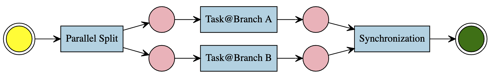
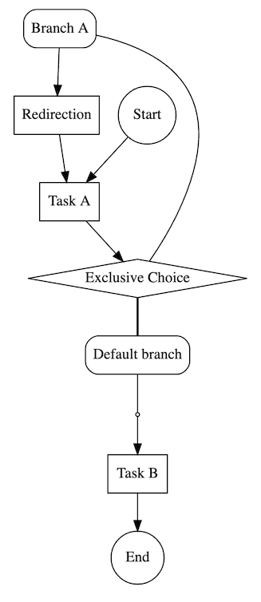
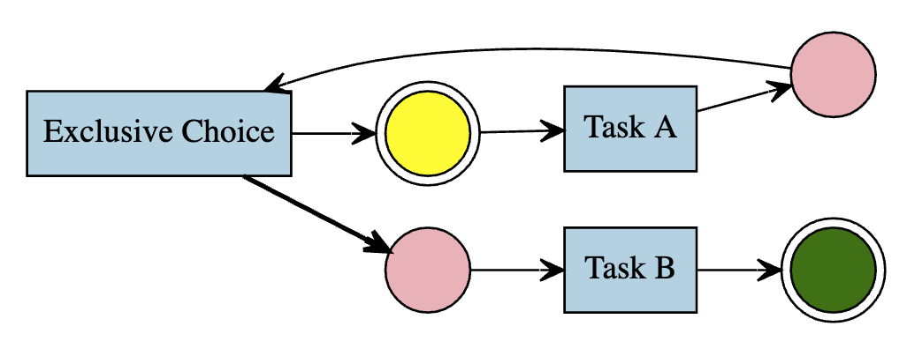
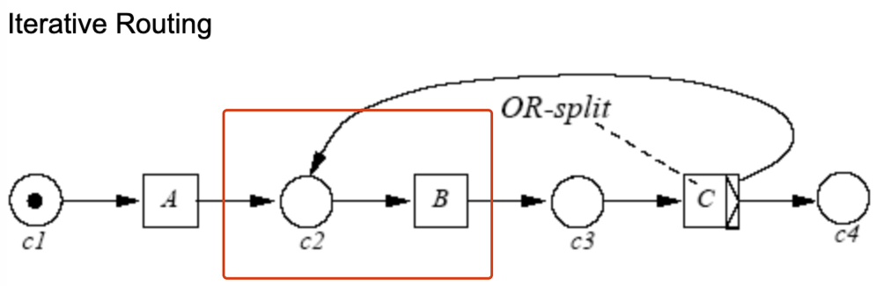
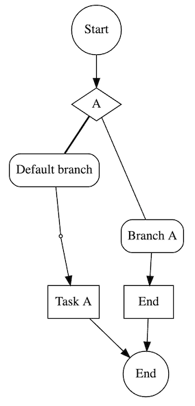
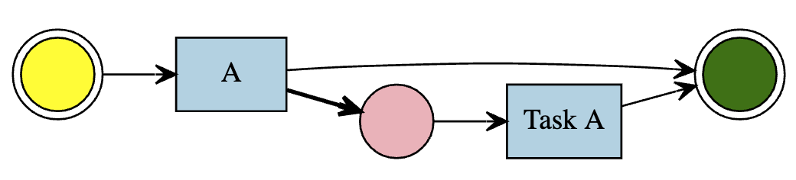

Pipeline 规则说明
====

Pipeline 是基于流程图的、面向可读性的、面向流程正确性的建模语言，无法用于执行，需要编译到 PetriNet。

步骤（Step）是 Pipeline 流程定义的最小单元，支持通过 `STI` 扩展，
基类模型源码位于 [app/models/flow_core/step.rb](/app/models/flow_core/step.rb)，
内置的步骤类型代码位于 [app/models/flow_core/steps](/app/models/flow_core/steps)，
步骤需要自行保证在编译到 PetriNet 后流程图的正确性，故一些步骤有特殊规则，并且在更新时重新检查，
若不正确，其 `verified` 字段将设置为 `false`，在编译时，若有不正确的步骤，Pipeline 则拒绝编译

由于一些步骤可以包含分支，故最终的流程图的内部结构是类似树的结构（树根为 Pipeline，每一层的步骤有序），编译成 PetriNet 则是有向有环图。

注：目前使用 `ancestry` 来维护树结构，使用 `acts_as_list` 来维护步骤的顺序

## 步骤的基本属性

`Step` 类型有一系列类方法（实例方法可覆盖）描述该步骤类型的性质，这些性质会影响 UI、步骤合法性检查和编译逻辑的行为

### 重定向步骤（`redirection_step?`）

该步骤的作用是重定向到另外的步骤

### 多分支步骤（`multi_branch_step?`）

该步骤可以包含分支（`branches`）

### 屏障步骤（`barrier_step?`）

作用是 **禁止** 其之下的 **重定向步骤** 的 **可跳转到的步骤列表** 包括屏障步骤及以外的步骤，
保障跳转后不破坏流程的正确性，防止出现如无限循环、无限分裂新任务等意外情况。

以并发分裂（Parallel Split）步骤（具体定义见下文）为例，该类型为屏障步骤，
作用是并发的执行每一个该步骤下的分支，如果某一个分支下的步骤是重定向步骤，且重定向到该并发分裂步骤本身或之前的步骤，
则并发分裂步骤会重新执行，又一次并发执行每一个分支，执行到重定向步骤后往复，导致流程在这里无限循环，这种情况是不期望的。

### 可附加工作流任务触发器（`transition_trigger_attachable?`）

工作流任务触发器（`TransitionTrigger`）的作用是在工作流任务启动时触发内置的逻辑，通常用途是创建业务任务。

### 分支可附加分支比较器（`branch_arc_guard_attachable?`）

分支比较器（`ArcGuard`）的用途是运行时判断是否允许流转到所在分支。

### 必须包含默认分支（`fallback_branch_required?`）

如果为真，则必须包含一个默认分支（`fallback: true` 的 `Branch`，一个步骤下最多只能有一个），默认分支不可附加分支比较器（`ArcGuard`）。

### 必须包含工作流任务触发器（`transition_trigger_required?`）

如果为真，则必须包含一个工作流任务触发器（`TransitionTrigger`）。

### 重定向目标步骤可配置（`redirection_configurable?`）

如果为真，则重定向到的目标任务可配置。

### 分支可配置（`branch_configurable?`）

如果为真，则允许创建删除修改分支（`Branch`）

## 内置步骤（Step）

### 任务（Task）

源码：[app/models/flow_core/steps/task.rb](/app/models/flow_core/steps/task.rb)

用于执行业务的步骤类型，必须关联 `TransitionTrigger`。

图例：

编译成 PetriNet 结果：

### 排他性分支选择（Exclusive Choice）

源码：[app/models/flow_core/steps/exclusive_choice.rb](/app/models/flow_core/steps/exclusive_choice.rb)

可以关联多个分支（Branch），分支可附加分支比较器（ArcGuard），
实际执行时，若满足分支比较器的条件，则流转到该分支，若所有分支的条件都不满足，则流转到默认分支（"Default Branch"），
默认分支会在创建排他性分支选择时创建，不可删除，不可附加分支比较器。

出于便利，可选关联 `TransitionTrigger`，即可以附加业务。

图例：

编译成 PetriNet 结果：

即 [Explicit OR split](https://www.tonymarston.net/php-mysql/workflow.html#explicit.or.split)
与 [OR join](https://www.tonymarston.net/php-mysql/workflow.html#or.join)
的组合

### 并发分裂（Parallel Split）

源码：[app/models/flow_core/steps/parallel_split.rb](/app/models/flow_core/steps/parallel_split.rb)

同时执行多个分支（Branch），所有分支均不可附加分支比较器，当所有分支都执行完毕时流程才会继续。

如果没有创建任何分支，编译时，该步骤会被忽略。

图例：

编译成 PetriNet 结果：

即 [AND split](https://www.tonymarston.net/php-mysql/workflow.html#and.split)
与 [AND join](https://www.tonymarston.net/php-mysql/workflow.html#and.join)
的组合

### 重定向（Redirection）

源码：[app/models/flow_core/steps/redirection.rb](/app/models/flow_core/steps/redirection.rb)

跳转到指定步骤，顶层流程不能有跳转节点，因为这样会导致无法走到终点，也不能出现在默认分支。

规则（代码位于 `Step#redirectable_steps`）：

- 不能跳转当前分支的步骤，因为这会导致死循环或者死步骤
- 不能跳到重定向步骤
- 依序获取祖先步骤，直到顶部或者屏障步骤（`barrier_step?`）
- 如果重定向步骤是分支的第一步，那么父步骤和其他也是处于（分支）第一步的祖先，也都要避免跳转，因为会导致死循环
- 跳到顶层（或者说主干）步骤都是安全的，只是要去掉跳转步骤的祖先，因为会导致死循环
- 跳转到任何其他步骤的分支也都是安全的，就是要避免分支是当前跳转步骤的祖先步骤

图例：

编译成 PetriNet 结果：

根据 PetriNet 规则，重定向连接的是目标步骤的前一个 Place，如图

### 结束（End）

源码：[app/models/flow_core/steps/end.rb](/app/models/flow_core/steps/end.rb)

跳转到结束，只能出现在允许附加分支比较器（`branch_arc_guard_attachable?`）的分支里。

图例：

编译成 PetriNet 结果：

