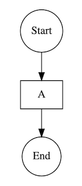
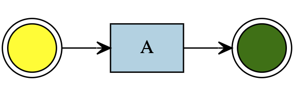
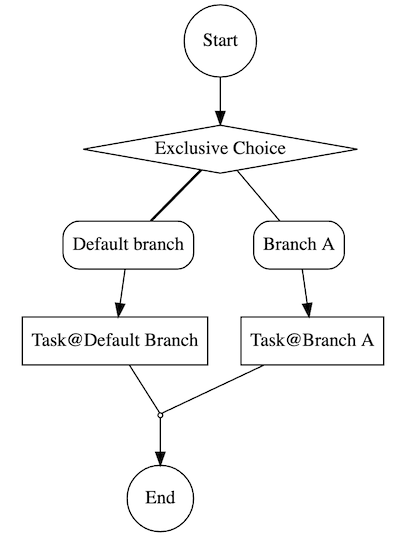
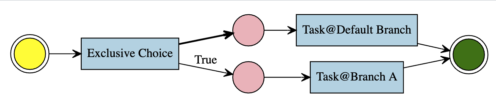

# Pipeline Rules Overview

---

**Pipeline** is a modeling language focused on readability and process correctness, based on flowcharts. It is not executable and must be compiled into **PetriNet**.

A **Step** is the smallest unit in the Pipeline flow definition and can be extended through `STI`. The base class model is located in `[app/models/flow_core/step.rb](/app/models/flow_core/step.rb)`, and built-in step types can be found in `[app/models/flow_core/steps](/app/models/flow_core/steps)`. Steps must ensure correctness after compiling to PetriNet. If a step is invalid, its `verified` field will be set to `false`, and Pipeline will refuse to compile if any invalid steps exist.

Since some steps may contain branches, the final flowchart has a tree-like structure. When compiled to PetriNet, it becomes a directed cyclic graph.

**Note:** `ancestry` is currently used to maintain the tree structure, and `acts_as_list` is used to maintain the order of the steps.

## Basic Attributes of a Step

Each `Step` type has several class methods (instance methods can be overridden) that describe the properties of the step type. These properties affect the behavior of the UI, step validation, and compilation logic.

### Redirection Step (`redirection_step?`)

This step redirects to another step.

### Multi-Branch Step (`multi_branch_step?`)

This step contains branches (`branches`).

### Barrier Step (`barrier_step?`)

This step **prohibits** the **list of target steps** that can be redirected to, preventing loops or infinite task splits. It ensures process correctness.

### Workflow Task Trigger Attachability (`transition_trigger_attachable?`)

A Workflow Task Trigger (`TransitionTrigger`) is triggered when a workflow task starts, usually to create a business task.

### Branch Arc Guard Attachability (`branch_arc_guard_attachable?`)

An Arc Guard (`ArcGuard`) evaluates whether a transition to a specific branch is allowed during runtime.

### Fallback Branch Requirement (`fallback_branch_required?`)

If `true`, there must be a fallback branch (`fallback: true`). Only one fallback branch is allowed per step, and it cannot have an Arc Guard.

### Transition Trigger Requirement (`transition_trigger_required?`)

If `true`, a Workflow Task Trigger (`TransitionTrigger`) must be attached.

### Configurable Redirection Target Step (`redirection_configurable?`)

If `true`, the target step for redirection can be configured.

### Configurable Branch (`branch_configurable?`)

If `true`, allows creating, deleting, and modifying branches (`Branch`).

## Built-in Steps

### Task

Source: `[app/models/flow_core/steps/task.rb](/app/models/flow_core/steps/task.rb)`

This step type executes business tasks and must be linked to a `TransitionTrigger`.

Illustration:

PetriNet Compilation Result:

### Exclusive Choice

Source: `[app/models/flow_core/steps/exclusive_choice.rb](/app/models/flow_core/steps/exclusive_choice.rb)`

This step allows multiple branches, and each branch can be associated with an Arc Guard (`ArcGuard`). During execution, if a branch condition is satisfied, the flow transitions to that branch. If no conditions are met, the flow moves to the default branch.

Illustration:

PetriNet Compilation Result:

...

Additional steps including **Parallel Split**, **Redirection**, and **End** follow similar patterns. More detailed explanations of each are included in the full document.
